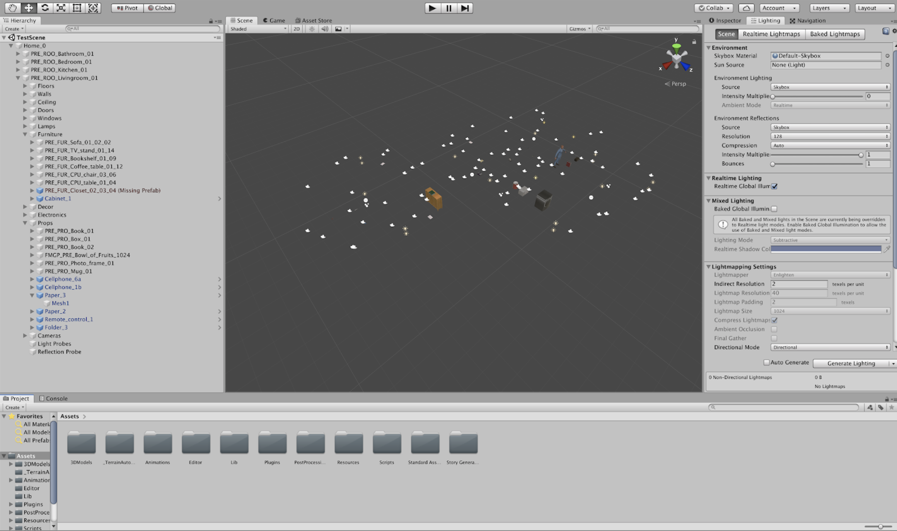

# Third Party Assets

VirtualHome uses a set of third party assets to include more 3D objects in the environment, and provide realistic motions for the agents. To make VirtualHome work, you will need to include these assets into the tool. 

Note that *you do not need to purchase the assets* if you are only planning to use the executable, which you can download from [virtual-home.org](www.virtual-home.org). This section is only needed if you want to build your own executables, or render scripts using the editor.

## Assets needed
We use the following assets in VirtualHome, which you will need to purchase to develop the tool.

| Asset Name  | Description | Price|
| ----------- | ---------   |------|
| [Complete Home Interior Pack](https://assetstore.unity.com/packages/3d/props/interior/complete-home-interior-pack-31049)      |  Contains 3D models of objects to populate the scenes, as well as the apartment layouts       |     35$      |
| [Modern House Interior Pack](https://assetstore.unity.com/packages/3d/props/interior/modern-house-interior-props-48564)   | Contains objects to populate the scene       |    35$       |
| [Final IK](https://assetstore.unity.com/packages/tools/animation/final-ik-14290) | Contains character animations, and tools to make the agent motions and object interactions more realistic. | 90$ |

To build an executable, open the project, click on the top menu in Unity and select:


## Including the assets in VirtualHome
After cloning VirtualHome, open the project in Unity and try opening a scene

```File > Open Scene > Assets/Story Generator/TestScene/TestScene.unity. ```

You will see an image as the one below. The cameras and a few objects are placed around an apartment layout, but there are mostly no objects, walls or textures. This means you need to include your assets. Follow the steps below to do that.




### Buying and Dowloading the assets
Click on each of the asset links in the table above, and purchase them assets using your Unity Account. Go into the *Unity Asset Store* and click on *My Assets*. You should see the 3 Assets you just purchased there. For each asset, click *Download* and after downloading click *Import*. This process should take a few minutes.

After having downloaded and imported your assets, try opening the Unity Scene. It should look as follows.


The new scene looks much more like an apartment, but one of the rooms is excessively lit. The only step left, is to patch the assets, which will slightly modifies the assets to create a more realistic look into the scene.


### Patching the assets
The assets need to be slightly modified to make VirtualHome work. You should follow 2 steps.

#### Solving error in `MinDrawer.cs`
When copying over the assets there will be an "unambiguous reference" error in a file called `MinDrawer.cs`. This is a known issue. To correct it, simply go to:

``` Assets/PostProcessing/Ediroe/PropertyDrawers/MinDrawer.cs ```

and add, before the namespace declaration, the following code:

```c#
using MinAttribute = UnityEngine.PostProcessing.MinAttribute;
```


#### Automatically Patching Assets
Look into the Unity menu (where you have the option to open a new scene or build the executable). There should be a new menu item. called Patch. Once you click it, you will see MHIP and CHIP. Click on each of these items once to patch the assets you purchased. You are now ready to use VirtualHome